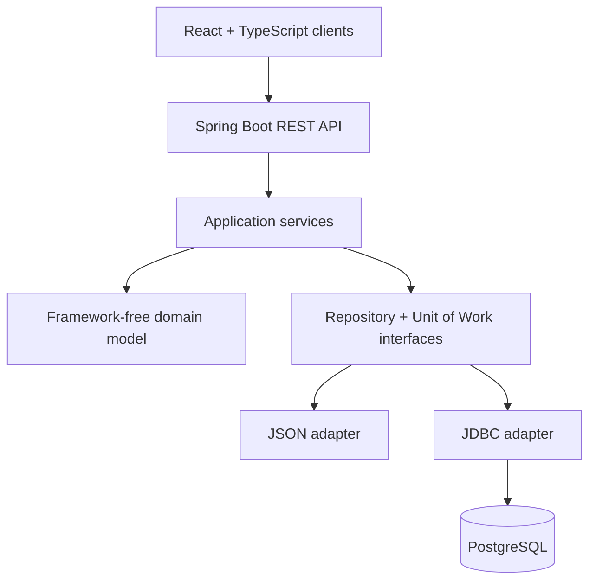

# MiniBank

[](https://github.com/d3m1d0s/VIS_mini-bank/actions/workflows/ci.yml)

MiniBank is a full-stack retail banking application built to demonstrate production-style backend
design without an ORM. It combines a Java 17 and Spring Boot REST API, PostgreSQL/JDBC persistence,
and React/TypeScript clients with hand-written Unit of Work, Identity Map and Lazy Loading patterns.

Customers can review accounts and payment history, create and confirm payments with a one-time
password, and cancel pending transfers. Risky payments enter a separate fraud-review workflow where
an analyst can investigate the alert, leave notes and approve or decline the transfer.

**Stack:** Java 17, Spring Boot, REST, PostgreSQL, JDBC, React, TypeScript, Vite, Maven, Docker,
JUnit 5, Mockito, Vitest and ESLint.


*Customer payment creation with beneficiary selection, real-time fee calculation and daily-limit tracking.*

## Highlights

- End-to-end payment flow with authentication, OTP authorization, cancellation and history.
- Rule-based risk checks and a dedicated fraud analyst workflow.
- Framework-independent domain model with repository and Unit of Work abstractions.
- JSON and PostgreSQL persistence adapters behind the same application services.
- Optimistic locking for accounts, transfers and fraud alerts to prevent lost updates.
- Parameterized JDBC queries, transactional writes and automated backend/frontend tests.

## Product walkthrough

### OTP payment authorization


*Pending transfers require OTP confirmation and expose retry limits, expiration time and fraud-review status.*

### Fraud review


*Rule-based alerts enter a dedicated analyst queue with assignment, customer history, case notes and approve/decline decisions.*

<details>
<summary><strong>View the complete fraud investigation workflow</strong></summary>

<br>

<p align="center">
  
</p>

<p align="center">
  <em>Complete analyst workspace with alert facts, transaction history, case notes and the final decision form.</em>
</p>

</details>

> All accounts, transactions and credentials shown above are synthetic demo data.

## Architecture



The domain and application layers do not depend on Spring or a persistence technology. Infrastructure
adapters implement the repository and Unit of Work interfaces for either a local JSON store or
PostgreSQL. See [`src/Project_structure.md`](src/Project_structure.md) for the complete package map.

## Quick start

The default demo uses the JSON store, so PostgreSQL and Docker are not required. Run these three
commands, using a second terminal for the web client:

```bash
git clone https://github.com/d3m1d0s/VIS_mini-bank.git && cd VIS_mini-bank
mvn -B spring-boot:run
```

```bash
cd VIS_mini-bank/minibank-web && npm ci && npm run dev
```

Open `http://localhost:5173` and sign in as `alice / alice123` for the customer application or
`fraud / fraud123` for the analyst desk. The demo one-time password is `0000`.

For PostgreSQL mode, both frontends, console applications and detailed configuration, continue with
[Running it](#running-it).

## Design notes
Every push to `main` and every pull request runs `.github/workflows/ci.yml`: the backend is built
and tested against a real PostgreSQL started by docker compose, the migrations are applied to both
databases, and both front ends are linted, tested and built.

## What is in here

- **Two persistence backends behind one set of repository interfaces**: a JSON document store and
  PostgreSQL. The in-memory piece is a `UserRepository` shim that JSON mode is handed in place of
  a persistent one; in JSON mode users are not persisted, so the demo logins the API creates live
  only as long as the process.
- **A hand written Unit of Work** for each backend, with an identity map and mutations that are
  registered and replayed at commit. Rollback is atomic across entities on the SQL side.
- **Lazy Load** wired into the JSON adapter. In SQL mode the lazy navigation methods return nothing
  rather than loading, which is a known gap rather than a design.
- **A REST API** on Spring Boot, and two console entry points that drive the same services.
- **Two web front ends, each of which serves both roles**: a customer application in a web idiom
  and a workstation in a window idiom. What they share is in `frontend-shared/`.
- Every JDBC statement that carries a value binds it as a `PreparedStatement` parameter; no value
  is ever concatenated into SQL text. The only plain `Statement`s are the constant-text `nextval`
  queries that allocate ids.

## Requirements

- Java 17 or newer. The build holds the code to the Java 17 API, so a current JDK works too.
- Docker, for PostgreSQL mode and for the SQL tests
- Node 20.19+ or 22.12+; Node 24 is recommended and used in CI

Maven is not on that list. The repository carries the Maven wrapper, `mvnw`, `mvnw.cmd` and
`.mvn/`, which downloads Maven 3.9.6 on first use, so nothing has to be on `PATH`.

Every command below is written for **PowerShell**. In Git Bash the wrapper is `./mvnw` rather than
`.\mvnw.cmd`, and the scripts are `scripts/up.sh`, `scripts/migrate.sh` and
`scripts/demo-reset.sh`; nothing else differs.

## Getting started

One command brings the database up and returns only when it is ready to take a connection:

```
.\scripts\up.ps1
```

It prints the three commands that are left, with the port this run actually published filled in.
There is nothing to watch and no `docker compose ps` to repeat.

The database is published on **55432**. That is the default in `docker-compose.yml`, so a clone
with no `.env` and no environment variable connects. Set `MINIBANK_DB_PORT` only when 55432 is
taken too; `.env.example` says what else has to move with it.

The container is `minibank-db-1`, the user and the password are both `minibank`, and it creates two
databases: `minibank` for the application and `minibank_test` for the SQL tests.

## Running it

### Starting the API

Against the database that is now up:

```
.\mvnw.cmd -B spring-boot:run "-Dspring-boot.run.jvmArguments=-Dminibank.storage=sql -Dminibank.sql.url=jdbc:postgresql://localhost:55432/minibank"
```

The quotes are required in PowerShell. Without them the argument is split on the colons and Maven
reports a plugin it cannot resolve, which reads like a network problem and is not one. The url is
on the line so that the command still holds when `MINIBANK_DB_PORT` has moved the database. On the
port compose publishes by default it repeats what `minibank.sql.url` already resolves to, and can
be left off.

If the store is PostgreSQL and nothing answers, the API prints the address it tried, the key that
points it there and the commands to fix it, then stops. There is no stack trace and no half-started
server that answers every request with a failure of its own.

It listens on `http://localhost:8080`. The `demo` profile is active by default, so it seeds a
sample customer and creates the demo logins. Watch the first seconds of the log for this line:

```
WARN [api] Demo profile is active: logins alice/alice123 and fraud/fraud123 are available
and the one time password is a fixed constant. Start with a different profile to disable this.
```

### The fastest path, no database

The API defaults to the JSON store, so nothing else has to be running:

```
.\mvnw.cmd -B spring-boot:run
```

The store is written to `storage/data.json`, which is not tracked by git.

One process at a time owns the store. A second one pointed at the same file refuses to start,
naming the sidecar lock file it found held, `storage/data.json.lock`; close the first process,
give the second one a store of its own with `-Dminibank.json.path`, or point both at PostgreSQL,
which is built for more than one writer. The lock file is empty and staying behind after a run is
normal; the claim lives with the running process, so deleting the file frees nothing.

### As a jar

```
.\mvnw.cmd -B package
java -jar target/minibank-1.0-SNAPSHOT.jar
```

`package` produces a runnable jar whose main class is the REST API.

### The two front ends

Each needs its dependencies installed once:

```
cd minibank-web; npm install; npm run dev
```

```
cd minibank-fraud-web; npm install; npm run dev
```

The customer application serves `http://localhost:5173` and the workstation
`http://localhost:5174`. Each proxies `/api` to `http://localhost:8080` through its own vite
config, so the API must be running and no cross origin configuration is needed.

The workstation on 5174 serves both roles: a fraud analyst gets the alert desk, and a customer gets
New payment, Waiting authorizations and Payment history in the same window idiom. The customer
application on 5173 serves both roles too, and an analyst who signs into it is taken straight to
the fraud desk and cannot reach the customer screens.

The skins differ on purpose and stay different: the customer application is dark and web shaped,
the workstation is light and drawn as a window. What the two hold in common is the structure and
the wording rather than the palette, and that common part is `frontend-shared/`.

The workstation carries a web manifest, so a browser can install it: in Chrome that is the
three dot menu, then Cast, save and share, then Install page as app. The installed copy opens in a
window of its own, titled MiniBank Workstation and carrying the same mark the tab does, with no tab
strip and no address bar. That is the whole of it. There is no service worker, nothing is cached,
and none of the screens work without the API running, so this is a window rather than an offline
application and it is not a packaged binary. The customer application has no manifest.

### The console applications

`App` uses the JSON store and has no login, which is why it is what a bare `exec:java` runs:

```
.\mvnw.cmd -B compile exec:java
```

An API already running in JSON mode holds `storage/data.json`, so `App` refuses to start beside
it; stop the API first, or give `App` a store of its own with `-Dminibank.json.path`.

`AppSql` uses PostgreSQL and signs you in first. Name it, and give it the url:

```
.\mvnw.cmd -B compile exec:java "-Dexec.mainClass=cz.vsb.minibank.AppSql" "-Dminibank.sql.url=jdbc:postgresql://localhost:55432/minibank"
```

Left at its default, `AppSql` seeds the sample customer and creates the same demo logins the
API's `demo` profile does, written into the database it connects to. Set `minibank.demo.enabled`
to `false` and it creates nothing, so the login prompt accepts only users that database already
holds.

There is also a scripted end to end run, which prints what it checked at each step:

```
.\mvnw.cmd -B compile exec:java "-Dexec.mainClass=cz.vsb.minibank.demo.DemoRunner" "-Dminibank.demo.reset=true"
```

It uses its own store, `storage/demo.json`, so it cannot disturb the application's, and
`minibank.demo.reset` discards that store before it runs.

### What the console is, and whether it is kept

It is a third surface rather than a leftover. `ui/console` is 750 lines, it is what the two entry
points above put in front of an operator, and it drives the same application services the REST API
does under the same role checks: eight commands, seven of them the customer's and one the
analyst's, each visible only to the role that may run it. Two test classes hold that behaviour
still, so a change to the services that broke the console would fail the build rather than be found
by whoever next opened it.

It is kept for one reason beyond the two entry points that name it. Adding a beneficiary exists
only here: the API offers `GET /api/me/beneficiaries` and no way to create one, so neither front
end can do it, and the saved recipients a payment form offers have to come from somewhere. New work
goes to the web applications, and the console is held at what it does today rather than grown.

## Signing in

The `demo` profile creates two logins on startup:

| Username | Password | Role |
|---|---|---|
| `alice` | `alice123` | customer |
| `fraud` | `fraud123` | fraud analyst |

**The one time password is the constant `0000`**, and `123456` is accepted as well. Nothing in the
user interface says so, so a payment cannot be confirmed without being told this.

These are throwaway local values, not secrets. No screen prints them; the running application
announces them once at startup, in the line quoted above.

The profile is active by default through `spring.profiles.default=demo` in
`src/main/resources/application.properties`. Switch it off with any other profile:

```
java -jar target/minibank-1.0-SNAPSHOT.jar --spring.profiles.active=plain
```

Under `plain` nothing is seeded and neither login exists, so the API serves only whatever data is
already in the store.

The fixed one time password is accepted only under the `demo` profile. Started with
`--spring.profiles.active=plain`, the API builds a validator that refuses every code and no payment
can be authorized; the refusal is announced in one line at startup rather than met at the
confirmation step.

The password hashing parameters changed with this version, nothing is stored beside a hash to say
which parameters wrote it, and the seeders never overwrite a user they find. A PostgreSQL database
seeded by an older version of this code therefore answers both demo passwords with 401. Empty the
tables with `.\scripts\demo-reset.ps1`, then start the API again with the demo active to reseed
them. JSON mode is untouched: its users live only in memory, so nothing hashed under the old
parameters survives a restart.

## Tests and quality checks

```
.\mvnw.cmd -B test
```

The SQL integration tests need a database of their own and there is no default address. Without
one they are skipped, naming the key:

```
.\mvnw.cmd -B test "-Dminibank.test.sql.url=jdbc:postgresql://localhost:55432/minibank_test"
```

A run that names no address opens no connection at all, so it cannot reach a PostgreSQL that
happens to be listening on the usual port. The quotes are required in PowerShell, for the reason
given above. The user and the password default to `minibank`, so only the url has to be given.

The tests use their own keys, `minibank.test.sql.*`, and refuse to start if pointed at the
application database, because they truncate every table.

There is one JavaScript test runner in the tree. vitest is installed only in `minibank-web`, and it
reaches the workstation and `frontend-shared` through the `projects` list in
`minibank-web/vite.config.ts`:

```bash
cd minibank-web
npm ci
npm run lint
npm test
npm run build
```

The standalone fraud application has its own lint and production-build gates:

```bash
cd minibank-fraud-web
npm ci
npm run lint
npm run build
```

`minibank-fraud-web` has no `test` script and is not meant to get one, so `npm test` inside that
directory does nothing. That is a decision rather than an oversight: a second install would be a
second vitest to keep in step with the first.

Every case in that run calls a function from `frontend-shared/` with values and checks what comes
back: parsing the amount a customer types, printing money and dates, the error contract, the queue
filters, the wording the two desks share. **Nothing renders a component**, and neither `jsdom` nor
a testing library is installed. That is deliberate: the logic worth pinning down was moved out of
the screens and into that module, where a plain call reaches it, and a render test would mostly
pin down markup that is still moving. One observation reverses it, a defect a person can see on a
screen while every function behind it still passes. That is the wiring between a component and the
module, which no function test can reach, and the first defect of that kind is what buys `jsdom`
and the render tests that follow it.

## The database

```
db/
  init/            run by the container, unattended, only on an empty volume
  migrate/         run by scripts/migrate, against both databases
  demo-reset.sql   empties the tables so the next API start seeds them again
  reset.sql        drops everything, run only on purpose
```

`db/init/schema.sql` is the whole schema: every table, index, constraint and sequence.
`db/init/test-database.sql` creates `minibank_test` and applies the same schema to it. Neither
drops anything, so `schema.sql` fails on a database that already has the tables rather than
emptying it.

### Migrations

`db/migrate/` exists for a volume that already holds data. **A fresh volume needs none of them**:
`schema.sql` already has everything they add.

`db/migrate/order.txt` declares the order the scripts run in, oldest first, and

```
.\scripts\migrate.ps1
```

applies all of them to both `minibank` and `minibank_test`. Pass `-DryRun` to print the plan
without connecting. The script refuses to run if the directory and `order.txt` have drifted apart
in either direction, and every script is safe to run twice.

Most of them change the shape of a table and are mirrored back into `schema.sql`, but not all of
them are that: `hold-alerted-transfers.sql` only moves rows and has nothing to mirror,
`fraud-alert-comment-and-notes-journal.sql` creates a table and then carries the old values into
it, and `2026-08-24-daily-limit-on-the-customer.sql` copies two columns onto another table before
dropping them. Each states in its own header what it does and why, and `order.txt` names the two to
read before re-running. Nothing records which of them a given database has already had, which is
why each is written to survive being run twice.

### Demo data

To get the demo dataset back after it has been paid down or left mid review:

```
.\scripts\demo-reset.ps1
```

Then restart the API. It empties the seven tables and resets their sequences; the schema, the
second database and every applied migration survive. `docker compose down -v` is no longer the way
to do this: it discards the volume and both databases with it.

To start from nothing, and only then:

```
docker compose down -v
```

**`-v` destroys the volume and every row in it.** It is also what makes `db/init/` run again:
without it the container keeps its data and a changed `schema.sql` is never applied.

## Configuration

The keys, all optional, are declared once in
`src/main/java/cz/vsb/minibank/application/MinibankProperties.java` and listed in
`application.properties`. The REST API resolves them through that file, the command line or the
environment; the console entry points read the same names as system properties, so one `-D` works
everywhere.

| Key | Default | What it is |
|---|---|---|
| `minibank.storage` | `json` | `json` or `sql` |
| `minibank.json.path` | `storage/data.json` | the JSON store |
| `minibank.demo.path` | `storage/demo.json` | the demo runner's own store |
| `minibank.demo.reset` | unset | `true` discards that store before the demo runs |
| `minibank.demo.enabled` | `true` | `false` stops the SQL console seeding the sample data and creating the demo logins; the API is switched by the `demo` profile instead |
| `minibank.sql.url` | `jdbc:postgresql://localhost:55432/minibank` | JDBC url |
| `minibank.sql.user` | `minibank` | |
| `minibank.sql.password` | `minibank` | |
| `minibank.log.file` | `storage/minibank.log` | where the application log is written |

The default url names 55432, the port compose publishes, so a clone that has not moved the port
connects with no url given at all. The commands above spell it out anyway, so that they still hold
on a machine where `MINIBANK_DB_PORT` had to be changed.

`minibank.log.file` behaves like the other keys on the REST API only: there it is resolved from
`application.properties`, the command line or the environment. The console entry points and the
demo runner have no such environment, so for them `-Dminibank.log.file=...` is the only way to move
the log.

The database keys were renamed. `minibank.jdbcUrl`, `minibank.dbUser` and `minibank.dbPass` are no
longer read: the console entry points refuse to start on them, and the REST API, which resolves
them through placeholders that never see an old name, warns at startup and says which value it is
using instead.

## Runtime state

`storage/`, `target/` and `node_modules/` are generated and are not tracked. Deleting
`storage/` is safe: under the `demo` profile the sample data is seeded again on the next start.

**A store that cannot be read stops the application from starting**, rather than being ignored so
that it silently comes up empty. If startup fails on a `storage/data.json` written by an older
version of this code, delete the file and start again.

## Licence

MIT. See [LICENSE](LICENSE).
