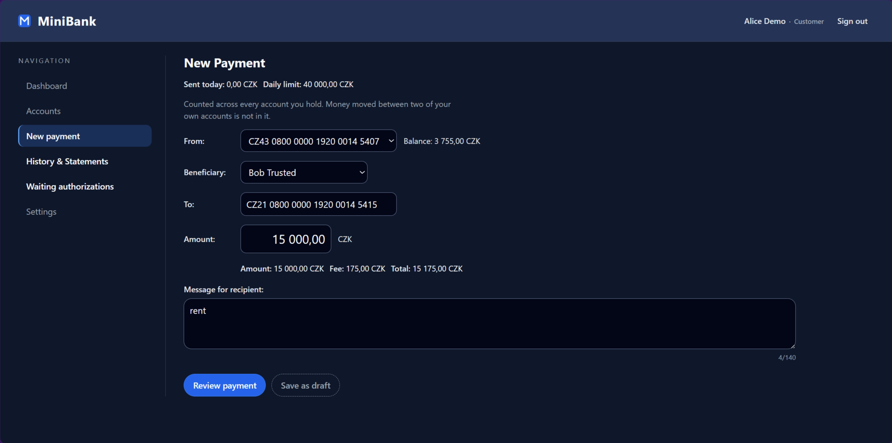
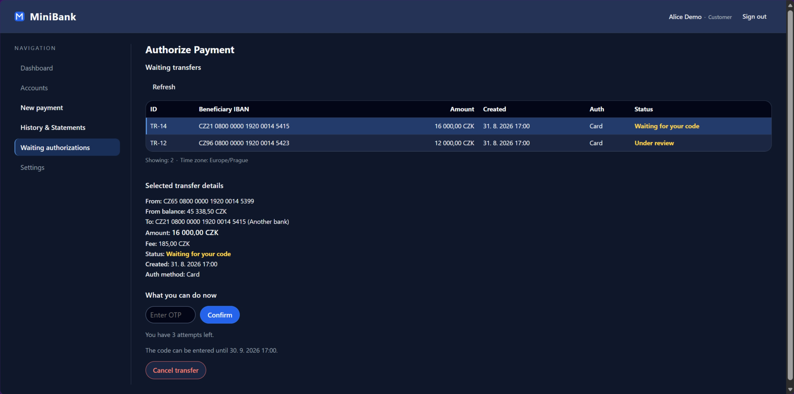
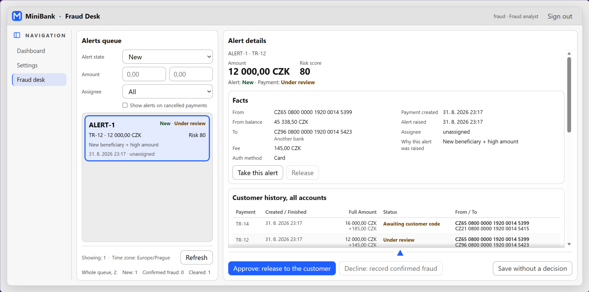
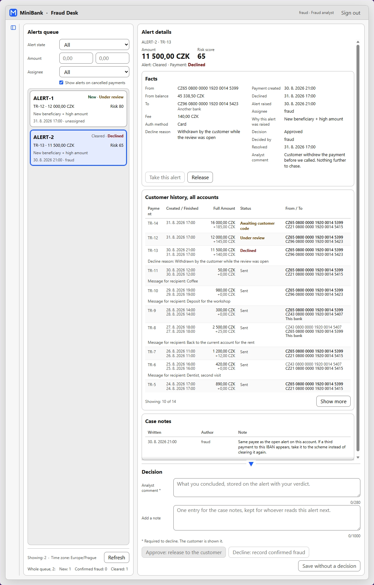
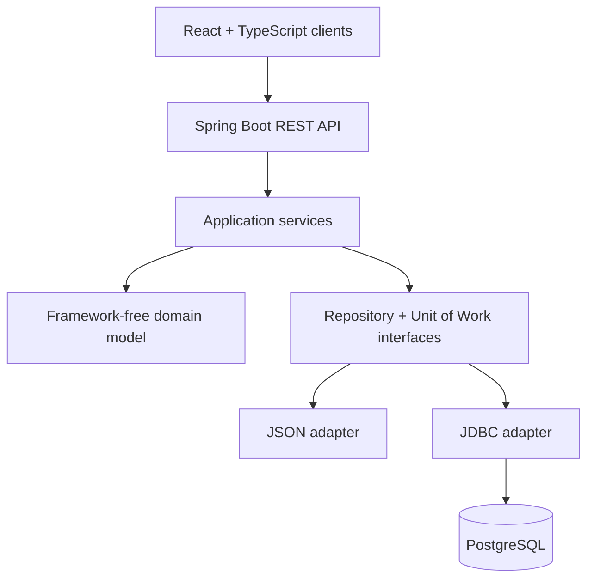

# MiniBank

[](https://github.com/d3m1d0s/VIS_mini-bank/actions/workflows/ci.yml)

MiniBank is a full-stack retail banking application built to demonstrate production-style backend
design without an ORM. It combines a Java 17 and Spring Boot REST API, PostgreSQL/JDBC persistence,
and React/TypeScript clients with hand-written Unit of Work, Identity Map and Lazy Loading patterns.

Customers can review accounts and payment history, create and confirm payments with a one-time
password, and cancel pending transfers. Risky payments enter a separate fraud-review workflow where
an analyst can investigate the alert, leave notes and approve or decline the transfer.

**Stack:** Java 17, Spring Boot, REST, PostgreSQL, JDBC, React, TypeScript, Vite, Maven, Docker,
JUnit 5, Mockito, Vitest and ESLint.



*Customer payment creation with beneficiary selection, real-time fee calculation and daily-limit tracking.*

## Highlights

- End-to-end payment flow with authentication, OTP authorization, cancellation and history.
- Rule-based risk checks and a dedicated fraud analyst workflow.
- Framework-independent domain model with repository and Unit of Work abstractions.
- JSON and PostgreSQL persistence adapters behind the same application services.
- Optimistic locking for accounts, transfers and fraud alerts to prevent lost updates.
- Parameterized JDBC queries, transactional writes and automated backend/frontend tests.

## Product walkthrough

### OTP payment authorization



*Pending transfers require OTP confirmation and expose retry limits, expiration time and fraud-review status.*

### Fraud review



*Rule-based alerts enter a dedicated analyst queue with assignment, customer history, case notes and approve/decline decisions.*

<details>
<summary><strong>View the complete fraud investigation workflow</strong></summary>

<br>

<p align="center">
  
</p>

<p align="center">
  <em>Complete analyst workspace with alert facts, transaction history, case notes and the final decision form.</em>
</p>

</details>

> All accounts, transactions and credentials shown above are synthetic demo data.

## Architecture



The domain and application layers do not depend on Spring or a persistence technology. Infrastructure
adapters implement the repository and Unit of Work interfaces for either a local JSON store or
PostgreSQL. See [`src/Project_structure.md`](src/Project_structure.md) for the complete package map.

## Quick start

The default demo uses the JSON store, so PostgreSQL and Docker are not required. Run these three
commands, using a second terminal for the web client:

```bash
git clone https://github.com/d3m1d0s/VIS_mini-bank.git && cd VIS_mini-bank
mvn -B spring-boot:run
```

```bash
cd VIS_mini-bank/minibank-web && npm ci && npm run dev
```

Open `http://localhost:5173` and sign in as `alice / alice123` for the customer application or
`fraud / fraud123` for the analyst desk. The demo one-time password is `0000`.

For PostgreSQL mode, both frontends, console applications and detailed configuration, continue with
[Running it](#running-it).

## Design notes

- **Two persistence backends behind one set of repository interfaces**: a JSON document store and
  PostgreSQL. The in-memory piece is a `UserRepository` shim that JSON mode is handed in place of
  a persistent one; in JSON mode users are not persisted, so the demo logins the API creates live
  only as long as the process.
- **A hand written Unit of Work** for each backend, with an identity map and mutations that are
  registered and replayed at commit. Rollback is atomic across entities on the SQL side.
- **Lazy Load** wired into the JSON adapter. In SQL mode the lazy navigation methods return nothing
  rather than loading, which is a known gap rather than a design.
- **A REST API** on Spring Boot, and two console entry points that drive the same services.
- **Two web front ends**: a customer application, which also carries the fraud desk for a signed in
  analyst, and a standalone analyst application. What they share is in `frontend-shared/`.
- Every JDBC statement that carries a value binds it as a `PreparedStatement` parameter; no value
  is ever concatenated into SQL text. The only plain `Statement`s are the constant-text `nextval`
  queries that allocate ids.

## Requirements

- Java 17 or newer. The build holds the code to the Java 17 API, so a current JDK works too.
- Maven 3.9 or newer
- Docker, for PostgreSQL mode and for the SQL tests
- Node 20.19+ or 22.12+; Node 24 is recommended and used in CI

## Running it

### The fastest path, no database

The API defaults to the JSON store, so nothing else has to be running:

```
mvn -B spring-boot:run
```

It listens on `http://localhost:8080`. The `demo` profile is active by default, so it seeds a
sample customer and creates the demo logins. Watch the first seconds of the log for this line:

```
WARN [api] Demo profile is active: logins alice/alice123 and fraud/fraud123 are available
and the one time password is a fixed constant. Start with a different profile to disable this.
```

The store is written to `storage/data.json`, which is not tracked by git.

One process at a time owns the store. A second one pointed at the same file refuses to start,
naming the sidecar lock file it found held, `storage/data.json.lock`; close the first process,
give the second one a store of its own with `-Dminibank.json.path`, or point both at PostgreSQL,
which is built for more than one writer. The lock file is empty and staying behind after a run is
normal; the claim lives with the running process, so deleting the file frees nothing.

### With PostgreSQL

Start the database from the compose file in this repository:

```
docker compose up -d
```

That publishes port 5432. **On most machines 5432 is already held by a local PostgreSQL**, so
publish a different one instead:

```
MINIBANK_DB_PORT=55432 docker compose up -d
```

In PowerShell:

```
$env:MINIBANK_DB_PORT = "55432"; docker compose up -d
```

Put `MINIBANK_DB_PORT=55432` in a `.env` file in the repository root to avoid repeating it. `.env`
is gitignored.

The container is `minibank-db-1`, the user and the password are both `minibank`, and it creates two
databases: `minibank` for the application and `minibank_test` for the SQL tests. Wait for the
healthcheck:

```
docker compose ps
```

Then start the API against it. Both properties are needed if you moved the port:

```
mvn -B spring-boot:run "-Dspring-boot.run.jvmArguments=-Dminibank.storage=sql -Dminibank.sql.url=jdbc:postgresql://localhost:55432/minibank"
```

The quotes are required in PowerShell. Without them the argument is split on the colons and Maven
reports a plugin it cannot resolve, which reads like a network problem and is not one.

### As a jar

```
mvn -B package
java -jar target/VIS_project_minibank-1.0-SNAPSHOT.jar
```

`mvn package` produces a runnable jar whose main class is the REST API.

### The front ends

Each needs its dependencies installed once:

```
cd minibank-web && npm install && npm run dev
```

```
cd minibank-fraud-web && npm install && npm run dev
```

The customer application serves `http://localhost:5173` and the analyst one
`http://localhost:5174`. Each proxies `/api` to `http://localhost:8080` through its own vite
config, so the API must be running and no cross origin configuration is needed.

### The console applications

`App` uses the JSON store and has no login, which is why it is what a bare `exec:java` runs:

```
mvn -B compile exec:java
```

An API already running in JSON mode holds `storage/data.json`, so `App` refuses to start beside
it; stop the API first, or give `App` a store of its own with `-Dminibank.json.path`.

`AppSql` uses PostgreSQL and signs you in first. Name it, and give it the url if you moved the
port:

```
mvn -B compile exec:java "-Dexec.mainClass=cz.vsb.minibank.AppSql" "-Dminibank.sql.url=jdbc:postgresql://localhost:55432/minibank"
```

Left at its default, `AppSql` seeds the sample customer and creates the same demo logins the
API's `demo` profile does, written into the database it connects to. Set `minibank.demo.enabled`
to `false` and it creates nothing, so the login prompt accepts only users that database already
holds.

There is also a scripted end to end run, which prints what it checked at each step:

```
mvn -B compile exec:java "-Dexec.mainClass=cz.vsb.minibank.demo.DemoRunner" "-Dminibank.demo.reset=true"
```

It uses its own store, `storage/demo.json`, so it cannot disturb the application's, and
`minibank.demo.reset` discards that store before it runs.

## Signing in

The `demo` profile creates two logins on startup:

| Username | Password | Role |
|---|---|---|
| `alice` | `alice123` | customer |
| `fraud` | `fraud123` | fraud analyst |

**The one time password is the constant `0000`**, and `123456` is accepted as well. Nothing in the
user interface says so, so a payment cannot be confirmed without being told this.

These are throwaway local values, not secrets. No screen prints them; the running application
announces them once at startup, in the line quoted above.

The password hashing parameters changed with this version, nothing is stored beside a hash to say
which parameters wrote it, and the seeders never overwrite a user they find. A PostgreSQL database
seeded by an older version of this code therefore answers both demo passwords with 401. Delete the
rows with `DELETE FROM users`, or destroy the volume with `docker compose down -v`, and start
again with the demo active to reseed them. JSON mode is untouched: its users live only in memory,
so nothing hashed under the old parameters survives a restart.

The profile is active by default through `spring.profiles.default=demo` in
`src/main/resources/application.properties`. Switch it off with any other profile:

```
java -jar target/VIS_project_minibank-1.0-SNAPSHOT.jar --spring.profiles.active=plain
```

Under `plain` nothing is seeded and neither login exists, so the API serves only whatever data is
already in the store.

An analyst who signs into the customer application is taken straight to the fraud desk and cannot
reach the customer screens. A customer who signs into the analyst application is refused.

## Tests and quality checks

```
mvn -B test
```

**This is green while silently skipping every test that needs a database.** Every test in
`MinibankSqlUowTests`, `SqlSchemaPassTest` and `SqlUserRepositoryTest` skips rather than fails
when no database is reachable, so that a fresh clone stays green. To actually run them, point
them at the test database:

```
mvn -B test "-Dminibank.test.sql.url=jdbc:postgresql://localhost:55432/minibank_test"
```

The quotes are required in PowerShell, for the same reason as above. The user and the password
default to `minibank`, so only the url has to be given.

The tests use their own keys, `minibank.test.sql.*`, and refuse to start if pointed at the
application database, because they truncate every table.

The front ends have one test runner between them, in `minibank-web`, and it covers the shared
module as well:

```bash
cd minibank-web
npm ci
npm run lint
npm test
npm run build
```

The standalone fraud application has its own lint and production-build gates:

```bash
cd minibank-fraud-web
npm ci
npm run lint
npm run build
```

Every case in it calls a function from `frontend-shared/` with values and checks what comes back:
parsing the amount a customer types, printing money and dates, the error contract, the queue
filters, the wording the two desks share. **Nothing renders a component**, and neither `jsdom` nor
a testing library is installed. That is deliberate: the logic worth pinning down was moved out of
the screens and into that module, where a plain call reaches it, and a render test would mostly
pin down markup that is still moving. One observation reverses it, a defect a person can see on a
screen while every function behind it still passes. That is the wiring between a component and the
module, which no function test can reach, and the first defect of that kind is what buys `jsdom`
and the render tests that follow it.

## The database

```
db/
  init/       run by the container, unattended, only on an empty volume
  migrate/    run by hand, against both databases
  reset.sql   drops everything, run only on purpose
```

`db/init/schema.sql` is the whole schema: every table, index, constraint and sequence.
`db/init/test-database.sql` creates `minibank_test` and applies the same schema to it. Neither
drops anything, so `schema.sql` fails on a database that already has the tables rather than
emptying it.

`db/migrate/` exists for a volume that already holds data. Each script is an online `ALTER`, is
mirrored back into `schema.sql`, and explains in its own header what it does and why. **A fresh
volume needs none of them**: `schema.sql` already has everything they add. Nothing records which of
them has been run, so their names describe rather than order.

To apply one, run it against **both** databases:

```
docker compose exec -T db psql -U minibank -d minibank      < db/migrate/currency-is-czk.sql
docker compose exec -T db psql -U minibank -d minibank_test < db/migrate/currency-is-czk.sql
```

In PowerShell, where `<` is a reserved operator:

```
Get-Content db/migrate/currency-is-czk.sql | docker compose exec -T db psql -U minibank -d minibank
```

To start from nothing:

```
docker compose down -v
```

**`-v` destroys the volume and every row in it.** It is also what makes `db/init/` run again:
without it the container keeps its data and a changed `schema.sql` is never applied.

## Configuration

The keys, all optional, are declared once in
`src/main/java/cz/vsb/minibank/application/MinibankProperties.java` and listed in
`application.properties`. The REST API resolves them through that file, the command line or the
environment; the console entry points read the same names as system properties, so one `-D` works
everywhere.

| Key | Default | What it is |
|---|---|---|
| `minibank.storage` | `json` | `json` or `sql` |
| `minibank.json.path` | `storage/data.json` | the JSON store |
| `minibank.demo.path` | `storage/demo.json` | the demo runner's own store |
| `minibank.demo.reset` | unset | `true` discards that store before the demo runs |
| `minibank.demo.enabled` | `true` | `false` stops the SQL console seeding the sample data and creating the demo logins; the API is switched by the `demo` profile instead |
| `minibank.sql.url` | `jdbc:postgresql://localhost:5432/minibank` | JDBC url |
| `minibank.sql.user` | `minibank` | |
| `minibank.sql.password` | `minibank` | |
| `minibank.log.file` | `minibank.log` | where the application log is written |

## Runtime state

`storage/`, `data/`, `target/` and `node_modules/` are generated and are not tracked. Deleting
`storage/` is safe: under the `demo` profile the sample data is seeded again on the next start.

**A store that cannot be read stops the application from starting**, rather than being ignored so
that it silently comes up empty. If startup fails on a `storage/data.json` written by an older
version of this code, delete the file and start again.
